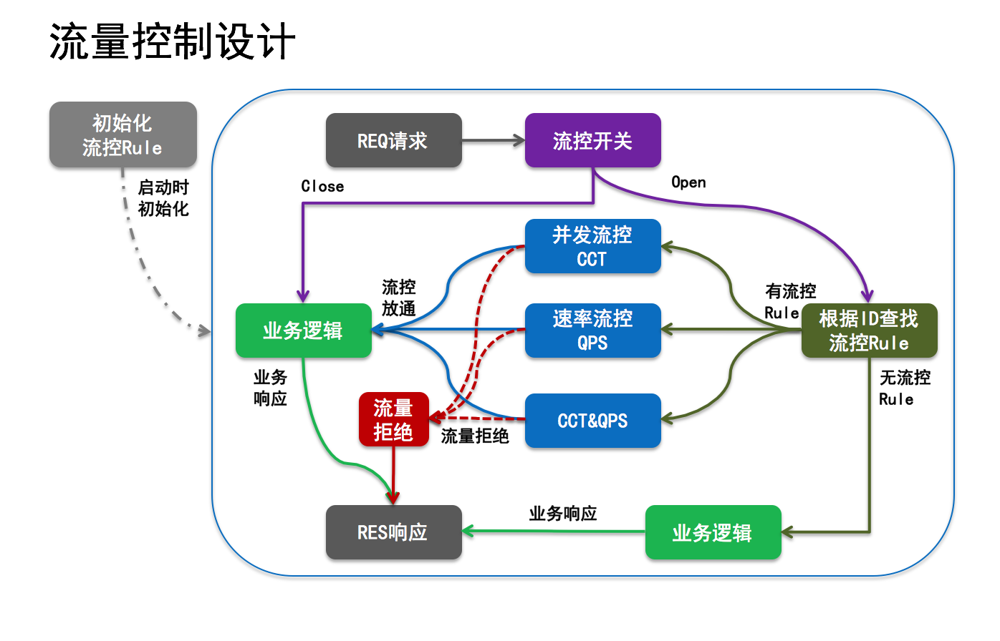
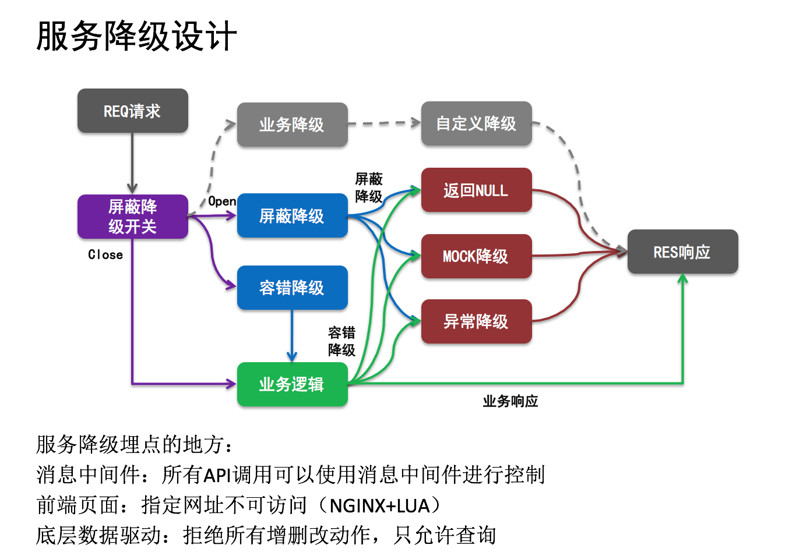
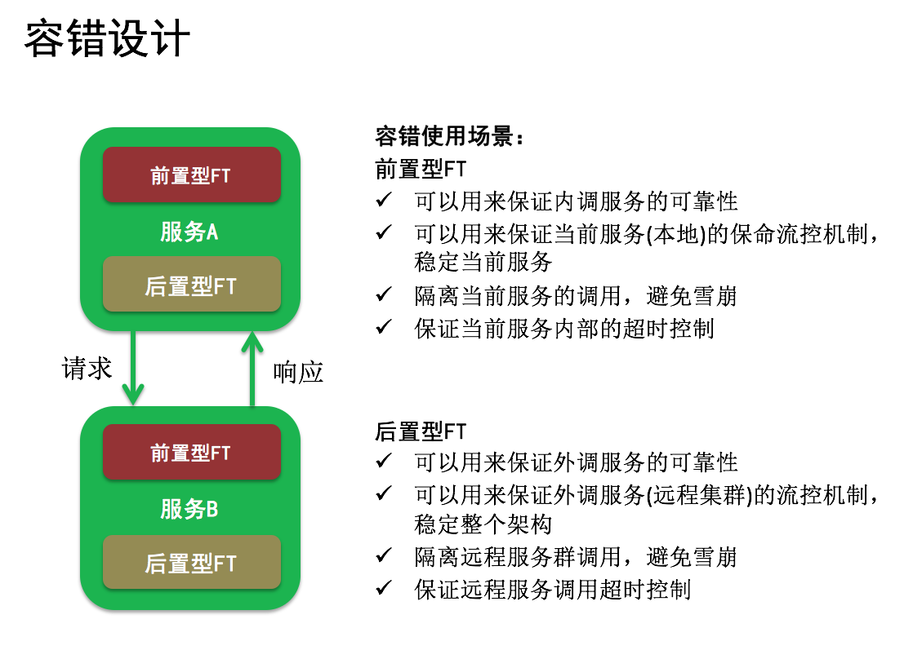
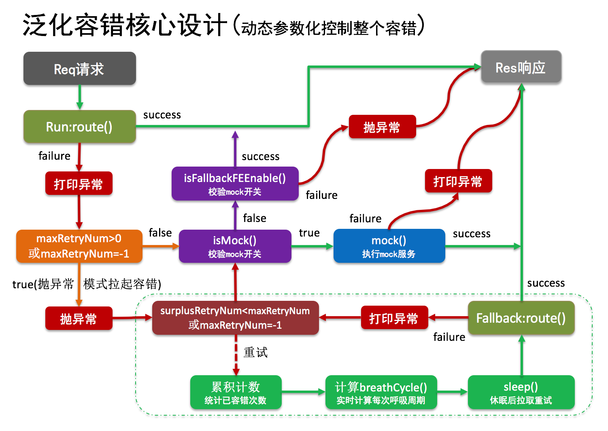

#微服务神经元(Neural)

分布式服务框架中的神经组织，主要为分布式架构提供:放通率控制、流量控制、服务降级、幂等机制、泛化容错、SLA熔断、隔离舱壁、超时控制和慢性尝试功能。 

##**QQ交流群：191958521(微服务神经元)**

###一、概要介绍

分布式依赖协调指挥组织(neural,即神经元)：在分布式环境下，将多个系统之间的依赖进行有序的指挥调度与组织协调。如：简单的服务A调用服务B,就可能需要同时协调5个(剩至更多)不同系统的服务,而该神经元则就是专门使用在该场景下,其不做具体的业务,只为指挥当前请求该调度谁,只协调各个服务之间的依赖关系。同时在该场景下,还引用该了Hystrix来提供了服务调度的错误隔离、舱壁隔离、超时控制,同时提供了失败重试、重试呼叫、调用链记录、耗时监控统计、放通率控制...

###二、目标定位
专业解决微服务场景下的指挥协调组织,为分布式依赖提供丰富的各类机制与监控协调链路。

###三、功能介绍
+ 泛化引用、泛化实现、回声探测
+ 链路追踪、容量规划、透明监控
+ 优雅停机→黑白名单→流量浮动→流量控制→服务降级(?)→幂等保障→灰度路由→[超时控制→舱壁隔离→服务容错→慢性尝试]

####3.1 泛化引用(已完成)
####3.2 泛化实现(已完成)
####3.3 优雅停机(进行中)
####3.4 黑白名单(已完成)
####3.5 流量浮动(已完成)

  当后端服务的不稳定性达到一定程度时，如果继续接收大量的请求，会严重影响服务的质量，大量的请求也会使脆弱的后端更加容易宕机，而后端应用突然宕机，则会将原本该进入该应用的所有请求分配至其他应用，进而增加了其他应用的压力。原本不稳定的应用突然增加了流量后，更加容易宕机，而流量如此不断的反复迁移，最终将会导致整个应用集群全部宕机。因此，应用为了自生“保命”，可以选择将部分流量拒绝，从而提供存活的概率。
  
####3.6 流量控制(已完成)

###1.使用场景
当某一片区的服务整体失败率较高时,我们可以选择拒绝部分请求,从而防止该片区集体宕掉或下线的问题；或者使用与流量的迁移过程。

###2.市场上主流的流量控制方式
+ **自研**：当你觉得自己的技术足够厉害,选择自行研发个性化的流控方案也是不错的选择。即自研的结果好坏与技术能力和经验程度成正比。

+ **漏斗流控：**
+ **令牌桶流控：通常情况下的优先选择方案**
+ **反压流控：**灵感来自于alibaba的开源项目jstorm，开源地址：https://github.com/alibaba/jstorm/wiki/Backpressure

因此，通常情况下流控方案的优略档次为：自研<漏斗流控<令牌桶流控<反压流控。

####3.7 回声探测(进行中)
####3.8 服务降级(已完成)

####3.9 幂等保障(已完成)
**1.背景**  
   在业务开发中，我们常会面对防止重复请求的问题。当服务端对于请求的响应涉及数据的修改，或状态的变更时，可能会造成极大的危害。重复请求的后果在交易系统、售后维权，以及支付系统中尤其严重。前台操作的抖动，快速操作，网络通信或者后端响应慢，都会增加后端重复处理的概率。重复消息是SOA服务实现中非常常见的问题，你永远不要指望调用方每次请求消息不一样，对于读操作，重复消息可能无害，可对于写操作很可能就是灾难。

因此，可以通过幂等(Idempotent)机制处理重复的消息，基本处理思路是： 
+ 调用者给消息一个唯一请求ID标识。ID标识一个工作单元，这个工作单元只应执行一次，工作单元ID可以是Schema的一部分，也可以是一个定制的SOAP Header，服务的Contract 可以说明这个唯一请求ID标识是必须的；
+ 接收者在执行一个工作单元必须先检验该工作单元是否已经执行过。检查是否执行的逻辑通常是根据唯一请求ID ，在服务端查询请求是否有记录，是否有对应的响应信息，如果有，直接把响应信息查询后返回；如果没有，那么就当做新请求去处理。

**2.使用场景**  
+ 防止重复提交
+ 保证服务请求的可靠性(尽可能的保证每一次请求都有响应,一次失败)

**3.定义**  
   在指定的时间窗(一段时间)内,失败后使用重复提交的方式来保证服务的高可靠性。当服务的一致性做得足够好,则可以使用幂等机制来实现所有请求的高可靠,否则该机制只能删除、查询、部分修改的操作,而针对新增是致命的。

**4.幂等方案**  
   对时间全局性要求高的，可能就必须选择DB这种持久化方案比较可靠，但是性能不够好啊（然后就要考虑loadmemory，以及数据同步的问题，就一步还要考虑实时性要求了）。在空间的要求中，根据不同的幂等范围，可以考虑分布式数据库（分布式集群全局流水号幂等）。还是某种少量数据幂等（可能只需要单台，做好主备）。

**5.数据的对象和范围**  
你要考虑你的幂等的全局性：空间全局性和时间全局性。
+ 空间全局性：比如是交易流水幂等还是用户ID幂等。是某种类型交易流水幂等，还是某个人|机构|渠道的交易流水幂等
+ 时间全局性：是幂等几秒，还是几分钟，还是永远。
不同的要求，可以有不一样的解决方案、难度和成本。

####3.10 灰度路由(进行中)
####3.11 超时控制(已完成)
在分布式依赖的模块，为防止服务端长时间等待远程响应的结果，而使用超时设置来控制远程消费异常的情况。

####3.12 舱壁隔离(已完成)
分布式服务在远程调用时,可为会发生未知的异常,进而可能会引起整个主服务进程都宕掉,则会导致大面积的服务瘫痪。为了防止单个服务依赖异常而引发其他服务一起陪葬的问题,需要对每一个远程依赖进行隔离。

####3.13 服务容错(已完成)
**1.设计场景：**  

**2.泛化容错核心设计:**  

**3.使用场景**  
主要用于分布式系统之间进行交互的代码模块,即容错有依赖的代码模块。当分布式系统之间发生远程通信时，需要对代码模块实现容错处理(不保证事务的一致性)。

####3.14 熔断恢复(已完成)
在一定的时间窗内,当分布式远程通信中的某一条线路的失败率达到一定的阀值时,系统需要暂时断掉该条线路,以保证后续的服务质量。在熔断一定的时间后,需要尝试线路是否正常,正常则恢复熔断,否则周期性检查是否恢复。

####3.15 慢性尝试(已完成)
针对失败重试场景，如果无限频繁进行重试，则会占用一定的资源(句柄、CPU、内存等)，如果设置了重试次数，则在重试次数消耗完后，无法恢复。因此我们需要动态的调整重试周期，让重试的频率由快逐渐变慢，即只需要控制重试频率的慢性变化，从而节省一定的资源消耗。

####3.16 异步回调(已完成)
####3.17 异常告警(已完成)

####其他功能
+ 布隆过滤
+ 迷你配置中心
+ 日志中心
+ 资源拷贝
+ SPI机制

###四、使用案例

###五、规划(TODO)
####5.1 待实现功能
+ 高可靠保障
+ 链路追踪
+ 容量规划
+ 透明监控

####5.2 捐赠
期待大家的支持，准备用于购买服务器来搭建集群Neural的虚拟中心环境，实时模拟在线场景，用于孵化Neural。以下为捐赠者清单(按时间先后进行排序)：  
虎子(30RMB)...  
