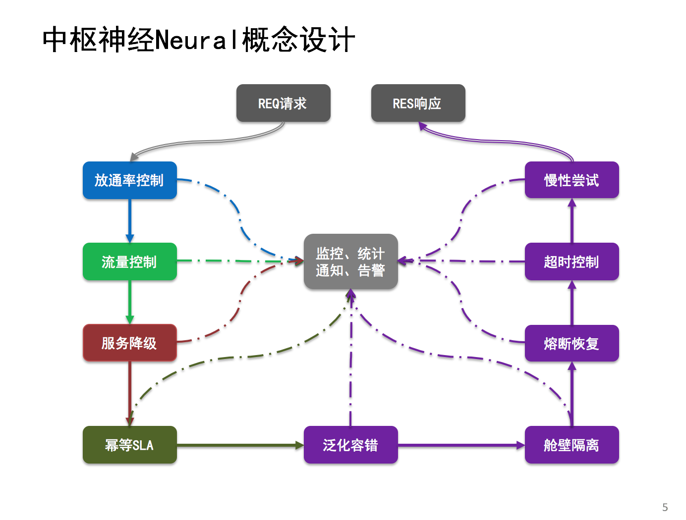

#微服务神经元(Neural)

分布式服务框架中的神经组织，主要为分布式架构提供:放通率控制、流量控制、服务降级、幂等机制、泛化容错、SLA熔断、隔离舱壁、超时控制和慢性尝试功能。 

##**QQ交流群：191958521(微服务神经元)**

###一、概要介绍

分布式依赖协调指挥组织(neural,即神经元)：在分布式环境下，将多个系统之间的依赖进行有序的指挥调度与组织协调。如：简单的服务A调用服务B,就可能需要同时协调5个(剩至更多)不同系统的服务,而该神经元则就是专门使用在该场景下,其不做具体的业务,只为指挥当前请求该调度谁,只协调各个服务之间的依赖关系。同时在该场景下,还引用该了Hystrix来提供了服务调度的错误隔离、舱壁隔离、超时控制,同时提供了失败重试、重试呼叫、调用链记录、耗时监控统计、放通率控制...

###二、目标定位
专业解决微服务场景下的指挥协调组织,为分布式依赖提供丰富的各类机制与监控协调链路。

###三、功能介绍
+ **基础功能**:泛化引用、泛化实现、泛化参数
+ **扩展功能**:优雅停机→黑白名单→管道缩放→流量控制→服务降级→幂等保障
+ **核心功能**:熔断恢复→超时控制→舱壁隔离→服务容错→慢性尝试→成功回调
+ **高级功能**:灰度路由、回声探测、链路追踪、容量规划、实时监控

####**3.1 基础功能**
####`3.11 泛化引用(已完成)`
泛化引用，即表示请求对象(REQ)和响应对象(RES)的泛化，使用者可以根据自身需求进行自定义注入请求对象和响应对象。	
####`3.12 泛化实现(已完成)`
泛化实现，即表示各类处理实现类的逻辑泛化，使用者使用时需要根据实际情况来实现各类操作，如：业务逻辑的泛化实现、回声探测和反弹探测的泛化实现、幂等校验、持久化的泛化等。
####`3.13 泛化参数(已完成)`
泛化参数，是所有模块都支持动态参数的选择性注入。
####`3.14 异常告警(进行中)`
支持整个微服务神经元的各个模块出现异常时的告警，使用者可根据不同来源的异常进行不同方式的选择性告警操作。
####`3.15 细粒度动态开关(已完成)`
支持各模块以及子模块的动态化开关管理，使用者可以根据动态变更配置进行各模块和子模块的开关变更。

####**3.2 扩展功能**
####`3.21 优雅停机(已完成)`
+ 优雅开机:通过动态变更配置信息，从而实现存活JVM的动态触发开机。
+ 优雅关机:通过动态变更配置信息，从而实现存活JVM的优雅关机。所谓优雅关机，主要设计思路为:当发起关机操作时,微服务神经元不在接收新的请求,转而等待正在处理中的所有请求处理完毕,当在一定周期内提前处理完毕当前的请求,则发出“可以停机了”的通知,否则发出“可以强行停机了”的通知。  

####`3.22 黑白名单(已完成)`
+ 黑名单:动态过滤掉配置中的泛化黑名单请求。
+ 白名单:动态过滤掉配置中的泛化白名单请求。

####`3.23 管道缩放(已完成)`
当后端服务出现大面积的不稳定(如失败率、失败次数较高),此时如果强行将后端服务直接停机,就会让原本流入该机器的所有流量全部一次转移至其他不稳定的机器上。原本不稳定的机器突然增加了大量的流量后,可能会出现宕机的风险,进而又将该机器的流量转移至其他机器,如此反复转移,最终将导致整个集群的雪崩。

为了解决该类问题,管道缩放则是通过“拒绝部分流量”来降低了失败的概率和数量,于此同时降低了雪崩的概率。
####`3.24 流量控制(已完成)`
+ 并发控制:使用JDK的信号量Semaphore来实现了微服务神经元的并发数控制。
+ 流速控制:使用了Google的限速器RateLimiter来实现了每秒钟的请求量。

####`3.25 服务降级(已完成)`
当大流量的涌入时,为了保证核心服务的可用,可以选择性牺牲掉部分非核心服务,从而将资源空闲出来供核心服务的开销使用,因此需要服务降级来实现该功能。针对服务降级组要包括四类模式和四类降级处理措施:
+ **服务降级模式**:屏蔽降级、容错降级、业务降级、非降级；
+ **服务降级措施**:返回NULL、抛出指定异常、调用本地MOCK服务、自定义降级策略。

####`3.26 幂等保障(已完成)`
在分布式环境中,可能因为网络抖动或其他位置原因,服务端在短时间内可能会受到多笔相同的交易。针对相同的交易,如果不加以控制,可能会对业务造成不可挽回的严重后果,如重复转账、充值等。
因此需要使用幂等机制来保障该类问题,幂等机制主要从以下两个方面进行控制：
+ 短时间内重复提交从而提高服务的成功率；
+ 多次提交的结果和一次提交的结果是一致的。

####**3.3 核心功能**
####`3.31 熔断恢复(已完成)`
在分布式环境中,可能会因为网络或资源抢占的因素,在短期内会引起大量的调度失败。如果针对该现象不加以控制,会出现长时间的大量业务失败。因此使用熔断恢复机制:在一定的周期内,如果失败率或失败数超过一定的阀值,就会触发熔断操作,即短期内不再处理新的请求。在一定的时间间隔后,会尝试接入一笔交易,该笔交易成功,则立即恢复正常;如果失败,则等待下一次的尝试校验。其原理类似于物理学上的保险丝熔断现象,因此称之为熔断恢复。
####`3.32 超时控制(已完成)`
####`3.33 舱壁隔离(已完成)`
在一个应用中,可能会因为一笔交易可能出现未知的异常,而该异常可能存在将整个应用“拉宕机”的风险。针对该类风险,我们使用不同的线程池将不同服务的处理进行舱壁化的隔离,使用不同的线程将不同的请求进行隔离。
####`3.34 服务容错(已完成)`
####`3.35 慢性尝试(已完成)`
####`3.36 成功回调(已完成)`

####**3.4 高级功能**
####`3.41 灰度路由(规划中)`
####`3.42 回声探测(进行中)`
####`3.43 链路追踪(规划中)`
####`3.44 容量规划(规划中)`

####其他功能
+ 布隆过滤
+ 日志中心
+ 高并发计数器
+ 性能测试
+ 资源拷贝
+ SPI机制
+ 个性化配置

###四、使用案例
TODO

###五、贡献与规划
####5.1 作者
以下为Neural的开源作者(按时间先后进行排序):  
@李景枫

####5.2 捐赠
期待大家的支持，准备用于购买服务器来搭建集群Neural的虚拟中心环境，实时模拟在线场景，用于孵化Neural。以下为捐赠者清单(按时间先后进行排序)：  
@虎子(30RMB)、@null(66RMB)...  
